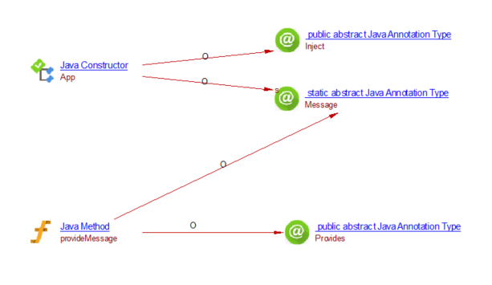
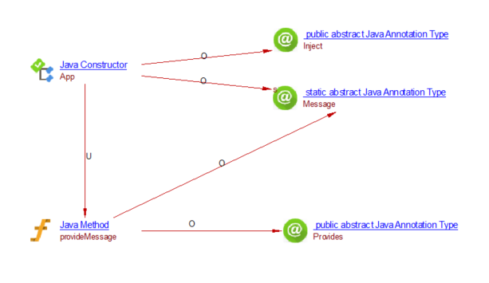
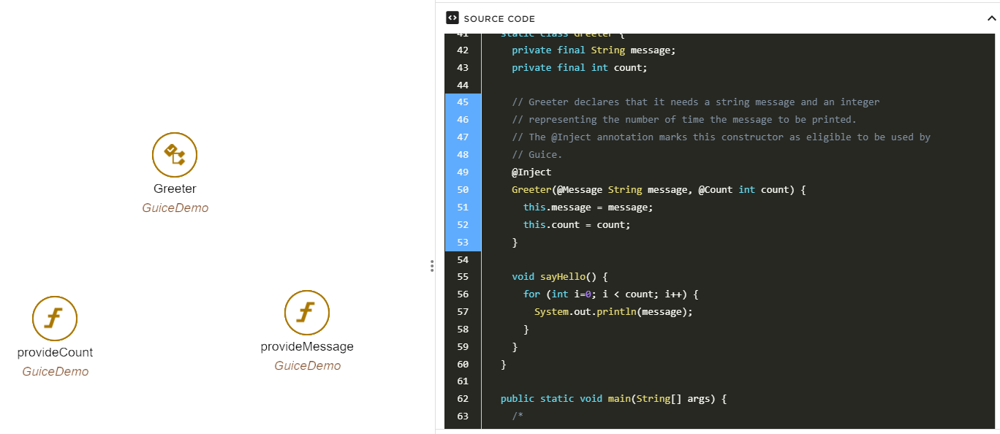
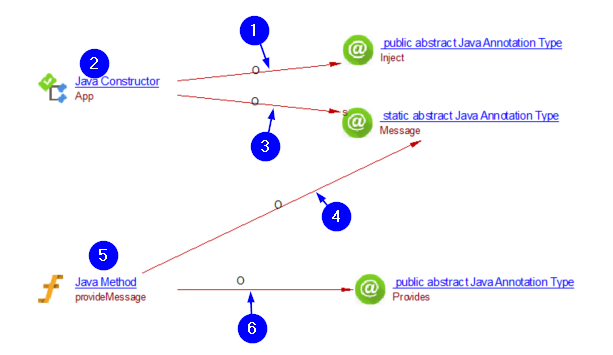

# Google Guice

## Introduction

This extension provides support for the Google Guice framework in Java applications.

## In what situations should you install this extension?

Whenever you need to analyze applications using the injection framework Google Guice and you want the CAST blueprints
and knowledge base to contain dependencies established by Google Guice injections.

Use cases covered:

- Knowledge Discovery / Blueprinting
- Function Point Counting

## CAST version compatibility

This extension leverages the CAST extension SDK, and as such is compatible with CAST AIP releases starting from 8.3.0.

It has been tested with CAST AIP 8.3.52

## Configuration instructions

No manual actions necessary. Simply install the extension to add detections for Google Guice.

## What results can you expect?

Additional links will be created in the knowledge base and will be available in CAST Imaging.

No additional objects are created.

### Links between @Inject members and @Provides methods

| Behavior without the extension                      | Behavior with the extension                            |
|-----------------------------------------------------|--------------------------------------------------------|
|  |  |
|  |  |

## Approach used to support Guice

1. Start by querying the links that lead to annotations @Inject and that originate from methods and constructors
1. That will give us a list of methods that use injection
1. For each of these methods, find all the other annotations they have, by querying the links that originate from the
   methods and lead to annotations
1. For each annotation found, find all the methods that are also referencing the same annotation
1. This gives us a list of methods that probably use Guice
1. Finally, filter by methods that are annotated by @Provides, meaning that we are sure they use Guice
1. Create the link between the method identified in 2 and the one identified in 5 

## Known limitations

- The bookmark for the links created points to the entire calling member. They could be more precise and show the exact
  annotation that triggered the detection.